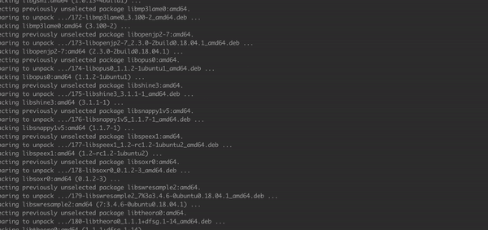

# Computer-Vision
- image manipulation 
- AR 
- Object tracking
- 3D scene reconstruction  

### Tech stack 
- OpenCV 
- Python 
- numpy 
- docker

# Detect and track objects 
- Simple Online and Realtime Tracking algorithms (SORT)
- track detected objects 
- Kalman filter (time series)

- detect object with SSD
- Implement SORT algorithm
- Real time transport control protocol 

### Profiling and accelerating 
- bottleneck 
- `pyinstrument` 
- accelerate with Numba 
    - optimized code compiler 
    - 

### How to run 
- without GPU acceleration 
- with GPU CUDA accceleration 

#### resource 
- https://www.xquartz.org/
